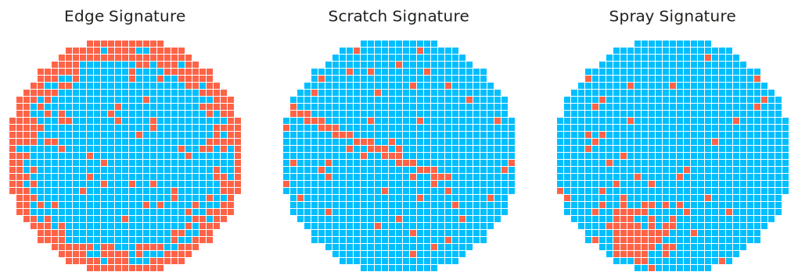
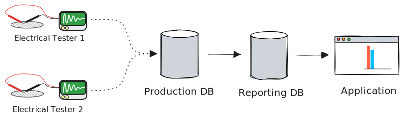

# Fragmented Spatial Scans with Batch Data Processing

## Background

This article is inspired by a real data engineering scenario encountered in semiconductor manufacturing. Before diving into the main topic, a few basics for those unfamiliar with the industry:

* The main manufacturing "unit" is the wafer - a circular disc comprised of an array of identical chips. The process involves building up the wafer (and chips) layer-by-layer. 
* Without getting into a broad overview of semiconductor process, it's worth noting that chip manufacturing generates massive amounts of structured data. One of the principle challenges facing semi engineers is effectively *harvesting* this data to drive intelligent decision-making.
* Prior to shipment to customer, each chip is electrically tested to ensure quality control. Additionally, the electrical test data is a critical ingredient used for **yield analysis** - identifying targeted improvements throughout the fab process which ultimately reduce end of line chip failures.

Perhaps the most quintessential method for visualizing electrical test performance is the **wafer map**, shown below.

<picture>
    <source media="(prefers-color-scheme: dark)" srcset="plot/case-study/single-wafer/single-wafer-annotated-dark.svg">
    
</picture>

Wafer maps help visualizing potential spatial patterns. Random failures tend to reflect baseline process noise, but *spatially correlated* failures often betray a specific root cause - ring patterns from non-uniform deposition, edge effects from a misaligned etch tool, or scratches from handling.

<picture>
    <source media="(prefers-color-scheme: dark)" srcset="plot/case-study/signature/signatures-dark.svg">
    
</picture>

 Below diagram shows the journey taken by electrical test data from **measurement** to **yield analysis application**. Note the separation between the Production and Reporting DB - this is vital to ensure Production DB remains available to support processing & movement of material (i.e. if the electrical testers cannot run, the line stops). 

<picture>
    <source media="(prefers-color-scheme: dark)" srcset="plot/case-study/probe-arch/probe-arch-dark.svg">
    
</picture>
