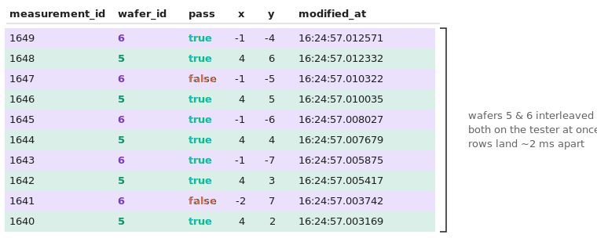
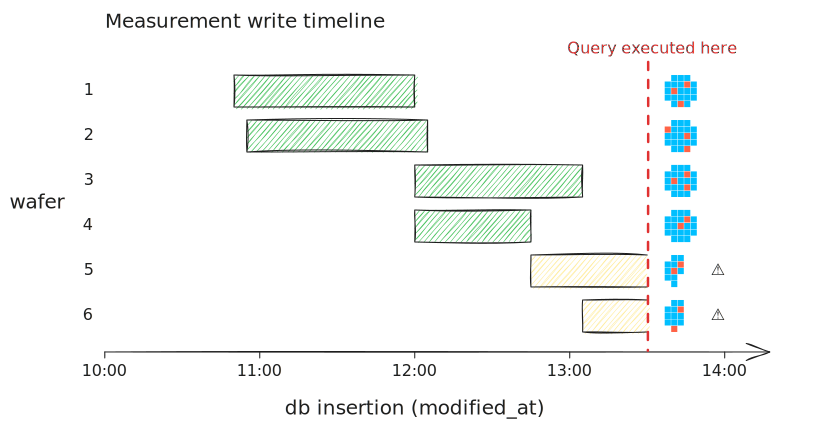
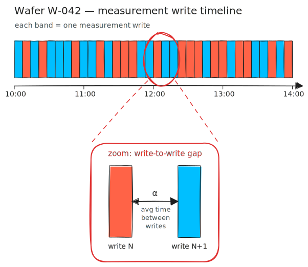
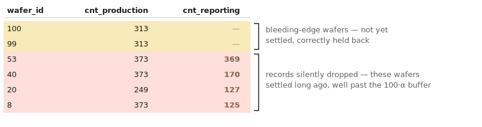
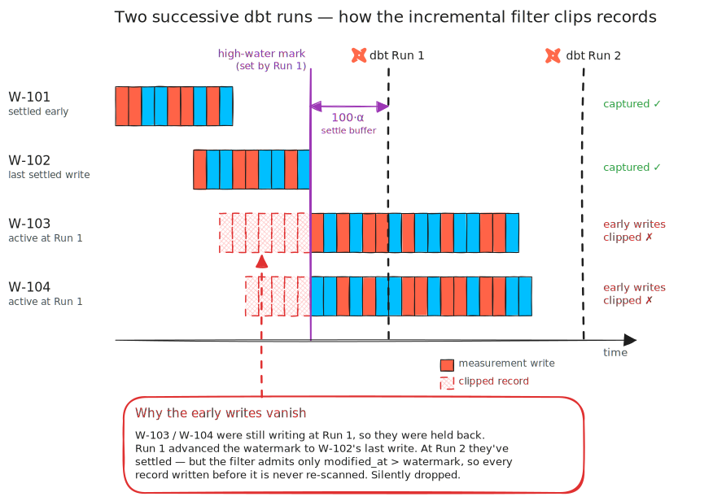

# Overcoming Fragmented Spatial Maps

## Background

Semiconductor manufacturing generates massive amounts of structured data. Harvesting insights from this data to drive better decision-making is one of the principal competencies of a semi engineer. But those insights rest on a long chain of data movement — and as we'll see, that path from tester to analyst is deceptively hard to engineer.

A few basics for those unfamiliar with the industry:

* The main manufacturing "unit" is the wafer - a circular disc comprised of an array of identical chips. The process involves building up the wafer (and chips) layer-by-layer. 
* Prior to shipment to customer, each chip is electrically tested to ensure quality control. Additionally, the electrical test data is a critical ingredient used for **yield analysis** - identifying targeted improvements throughout the fab process which ultimately reduce end of line chip failures. 
* Perhaps the most quintessential method for visualizing electrical test performance is the **wafer map**, shown below.

<p align="center">
    <picture>
        <source media="(prefers-color-scheme: dark)" srcset="plot/case-study/single-wafer/single-wafer-annotated-dark.svg">
        
    </picture>
</p>
<p align="center"><sub><em>Figure 1: A wafer map. Each cell is a single chip, colored by its electrical test result.</em></sub></p>

Wafer maps help visualize potential spatial patterns. Random failures tend to reflect baseline process noise, but *spatially correlated* failures often betray a specific root cause - ring patterns from non-uniform deposition, edge effects from a misaligned etch tool, or scratches from handling.

<p align="center">
    <picture>
        <source media="(prefers-color-scheme: dark)" srcset="plot/case-study/signature/signatures-dark.svg">
        
    </picture>
</p>
<p align="center"><sub><em>Figure 2: Spatially correlated failure signatures — rings, edge effects, and scratches — each pointing to a distinct root cause.</em></sub></p>

## The Data Engineering Challenge

Below diagram shows the journey from **measurement** to **analysis application**. Note the separation between the Production and Reporting DB - this is vital to ensure Production DB remains available to support processing & movement of material (i.e. if the electrical testers cannot run, the line stops). 

<p align="center">
    <picture>
        <source media="(prefers-color-scheme: dark)" srcset="plot/case-study/probe-arch/probe-arch-dark.svg">
        
    </picture>
</p>
<p align="center"><sub><em>Figure 3: The journey of electrical test data, from measurement to analysis application. The Production and Reporting DBs are deliberately kept separate.</em></sub></p>

For the purposes of this case study, we'll assume both databases live in the same environment, so we *could* easily mirror Production into Reporting.

The challenge lies in what that faithful mirror hands us. Because we have no control over how the Production DB is written, the electrical test data lands in the Reporting DB exactly as production produced it — and as we'll see, that's where things get interesting.

Suppose the factory is running at full capacity: our testers are continuously measuring wafers and writing to the Production DB, which is natively replicated to the Reporting DB with minimal latency. Now imagine someone opens the Application to plot the six most recent wafer maps. As the figure below shows, some of them come back **incomplete**:

<p align="center">
    <picture>
        <source media="(prefers-color-scheme: dark)" srcset="plot/case-study/six-pack/six-pack-dark.svg">
        
    </picture>
</p>
<p align="center"><sub><em>Figure 4: The six most recent wafer maps. Wafers 5 and 6 come back incomplete — their measurements are still being written to the Production DB.</em></sub></p>

From an end-user perspective, this is unacceptable. Not only would incomplete maps undermine trust in the Reporting Application, but the gaps are silent — anyone generating statistics in the data layer would be unwittingly aggregating on incomplete information.

To untangle this, let's start at the source. In the bleeding-edge records below, notice that wafers 5 and 6 are **interleaved** — the testers are probing both simultaneously, so their measurements arrive row-by-row. **This is why simply dropping the latest wafer doesn't work**: at any given moment, *several* wafers sit unfinished at the bleeding edge, not just the single most recent one.

```sql
select
  measurement_id, -- autoincrement identity
  wafer_id, -- corresponds to Figure 4 above
  pass,
  x,
  y,
  modified_at -- prod db insertion timestamp
from raw.measurement
order by measurement_id desc
limit 10
```

Need to adjust modified_at col width

<p align="center">
    <picture>
        <source media="(prefers-color-scheme: dark)" srcset="plot/case-study/six-pack/interleaved/interleaved-dark.svg">
        
    </picture>
</p>
<p align="center"><sub><em>Figure 5: The ten most recent measurement records. Rows for wafers 5 and 6 alternate — the two are on the tester at once, so their measurements land in the Reporting DB interleaved, within seconds of each other.</em></sub></p>

Figure 6 provides a temporal representation of database write activity by wafer — and shows what happens when a query cuts across wafers still being written.

<p align="center">
    <picture>
        <source media="(prefers-color-scheme: dark)" srcset="plot/case-study/timeline/timeline-dark.svg">
        
    </picture>
</p>
<p align="center"><sub><em>Figure 6: A timeline of when each wafer's measurements are written to the database. Wafers 1–4 finish before the moment the query runs; wafers 5 and 6 are still being written as the query executes, so their maps come back incomplete.</em></sub></p>

So why not just detect completion directly? Every route is blocked — and the owner of the production system is unable (or unwilling) to accommodate any change that would make our lives easier:

* **No fixed-count filter.** Wafers vary in total chip count, so we can't expose only those that have reached some fixed number of chips.
* **No completion flag.** The producer writes no flag on the final record for a given `wafer_id`.
* **No transaction boundary.** There's no way to wrap all of a wafer's inserts into a single transaction.

## The Solution

Since the source gives us no signal that a wafer is complete, we have to infer it — and the one thing we *do* have is timing. A wafer whose writes have gone quiet is almost certainly finished; one still receiving inserts is not. So we need a buffer between the Production and Reporting DB that holds a wafer back until *all of it* has settled.

This is where we drop the native replication. Rather than mirroring Production straight through to the Application, we route the raw data through a **dbt** model that applies a **watermark** — a cutoff that surfaces a wafer only once its writes have gone quiet, holding the still-arriving bleeding edge out of view.

Suppose we look at a single wafer. We have no completion flag, but every record carries `modified_at`. Take the most recent write for that wafer: if it landed a while ago and nothing has followed, the wafer has gone quiet — and we can safely call it complete. Concretely, a wafer is *settled* once its latest write is older than a fixed buffer:

```sql
-- "settled" = the wafer's last write is a full buffer behind
-- the newest write anywhere in the data (not wall-clock now())
max(modified_at) < (select max(modified_at) from source) - interval '<buffer>'
```

But how do we set an appropriate interval? Too short and we'll publish a wafer mid-write; too long and the Application needlessly lags reality.

Let **α** be the average time between consecutive measurement writes for a wafer (Figure 7). While a wafer is still being probed, a new write lands every α or so; once it's truly done, that stream stops for good.

<p align="center">
    <picture>
        <source media="(prefers-color-scheme: dark)" srcset="plot/case-study/band-gap/band-gap-dark.svg">
        
    </picture>
</p>
<p align="center"><sub><em>Figure 7: A single wafer's writes over time — each band is one measurement. The zoom defines α, the average gap between consecutive writes.</em></sub></p>

The buffer just needs to be comfortably longer than α, so that a normal gap between writes is never mistaken for the wafer finishing. And since the only cost of overshooting is a little latency, we can afford to be wildly conservative — setting the threshold to, say, **100·α** leaves an enormous margin: a wafer is declared complete only after a silence 100 times longer than its typical write cadence.

Before we build our dbt model, we should be mindful that in a manufacturing production setting this table grows without bound — so recomputing from scratch each run quickly becomes untenable. Hence the `` block in the draft solution below.

### Draft Solution

```sql
{{ 
    config(
        materialized='incremental', 
        unique_key='measurement_id'
    )
}}

with source as (
    select *
    from raw.measurement
    
    -- only rows written since the last run
    where modified_at > (select max(modified_at) from {{ this }})
    
),

settled as (
    select wafer_id
    from source
    group by wafer_id
    -- settled once the wafer's last write is 100·α seconds behind the newest write in source
    having max(modified_at) < (select max(modified_at) from source) - interval '<100·α> seconds'
)

select *
from source
where wafer_id in (select wafer_id from settled)
```

Let's imagine we ran continuously ran the draft dbt model over the course of 100 wafer scans. Comparing the production data and reporting (dbt target), we see, yet again, records have been silently skipped.

<p align="center">
    <picture>
        <source media="(prefers-color-scheme: dark)" srcset="plot/case-study/mismatch/table-comparison-dark.svg">
        
    </picture>
</p>
<p align="center"><sub><em>Figure 8: Auditing the Draft Solution. The bleeding-edge wafers (top) are correctly held back — but several settled wafers (bottom) come up silently short, their Reporting counts falling below Production even though they settled well past the 100·α buffer.</em></sub></p>

*This* is the crux of this entire scenario - the incremental filter only admits rows *newer* than what we've already written to the target. When dbt runs and (1) several new wafers are detected as *settled* and (2) several active wafers are unsettled, records associated with (2) inserted hitherto will get swept under the rug, as shown below.

<p align="center">
    <picture>
        <source media="(prefers-color-scheme: dark)" srcset="plot/case-study/timeline-two-run-clip/timeline-two-run-clip-dark.svg">
        
    </picture>
</p>
<p align="center"><sub><em>Figure 9: The mechanism behind Figure 8's missing records, traced across two dbt runs.</em></sub></p>

The fix is to stop keying on "new rows" and instead **over-extract**: on every run, re-scan a fixed trailing window wide enough to re-evaluate any wafer that could still be unsettled. Rows we've already published simply upsert unchanged (that's what `unique_key` buys us), so re-reading them is free of consequence.

### Final Solution

```sql
{{ 
    config(
        materialized='incremental', 
        unique_key='measurement_id'
    )
}}

with source as (
    select *
    from raw.measurement
    
    -- over-extract by the max known wafer scan duration so no settled wafer is clipped;
    -- increase as materialization performance allows
    where modified_at > (select max(modified_at) from {{ this }}) - interval '<over extract>'
    
),

settled as (
    select wafer_id
    from source
    group by wafer_id
    -- settled once the wafer's last write is 100·α seconds behind the newest write in source
    having max(modified_at) < (select max(modified_at) from source) - interval '<100·α> seconds'
)

select *
from source
where wafer_id in (select wafer_id from settled)
```

## Closing Thoughts
What inspired me to write about this scenario was not the extent / complexity of the solution, but the various subtle pitfalls the solution is designed to mitigate. Discovering each pitfall was a "gotcha" moment in my journey toward becoming a better data engineer. Some key takeaways I think are universally applicable:

* Always ask - *how* is the data going to be consumed? A data engineer's job doesn't end at `insert/update`.
* Thoughtful incrementalization matters - a data team's reputation depends on it. During project planning, always budget time for refining incremental strategy.
* Know when to push back. Some burdens belong to the producer, not you — and deciding when to absorb the complexity yourself versus press for an upstream fix is a constant balancing act.