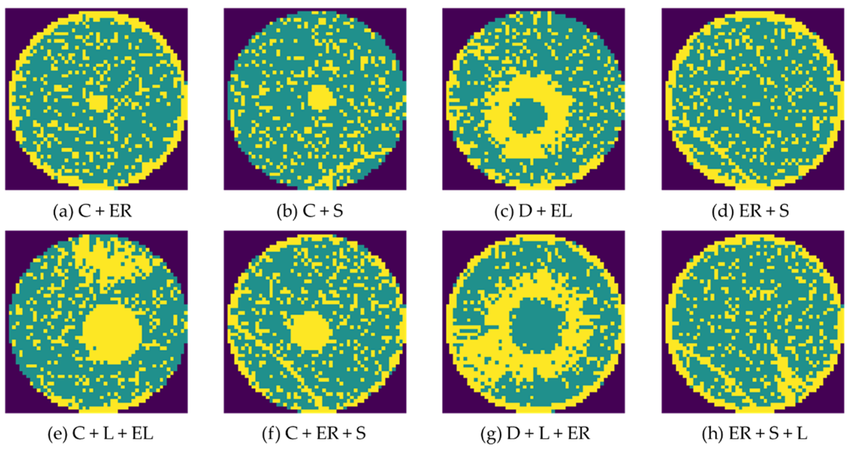

# Fragmented Spatial Scans with Batch Data Processing

## Background

This article is inspired by a real data engineering scenario encountered in semiconductor manufacturing. Before diving into the main topic, a few basics for those unfamiliar with the industry:

* The main manufacturing "unit" is the wafer - a circular disc comprised of an array of identical chips. The process involves building up the wafer (and chips) layer-by-layer. 
* Without getting into a broad overview of semiconductor process, it's worth noting that chip manufacturing generates massive amounts of structured data. One of the principle challenge facing semi engineers is effectively *harvesting* this data to drive intelligent decision-making.
* Prior to shipment to customer, each chip is electrically tested to ensure quality control. Additionally, the electrical test data is a critical ingredient used for **yield analysis** - identifying targeted improvements throughout the fab process which ultimately reduce end of line chip failures.

Perhaps the most quintessential method for visualizing electrical test performance is the **wafer map**, shown below.

<picture>
    <source media="(prefers-color-scheme: dark)" srcset="plot/case-study/single-wafer/single-wafer-annotated-excalidraw-dark.svg">
    
</picture>

Wafer maps help visualizing potential spatial patterns. Random failures tend to reflect baseline process noise, but *spatially correlated* failures often betray a specific root cause - ring patterns from non-uniform deposition, edge effects from a misaligned etch tool, scratches from handling, or recurring signatures tied to a particular probe test. Below shows some real examples from a public dataset.

<figure>
  
  <figcaption>Cha, Jaegyeong & Jeong, Jongpil. (2022). Improved U-Net with Residual Attention Block for Mixed-Defect Wafer Maps. Applied Sciences. 12. 2209. 10.3390/app12042209.</figcaption>
</figure>

Wafer maps are often surfaced to Fab engineers in analytics applications several layers downstream of the original data collection. Below diagram shows electrical testers writing to a production database, from which data is incrementally extracted and loaded into a reporting database. This Case Study focuses on the nuances of this batch process.

<picture>
    <source media="(prefers-color-scheme: dark)" srcset="plot/case-study/probe-arch/probe-arch-binary-dark.svg">
    
</picture>
